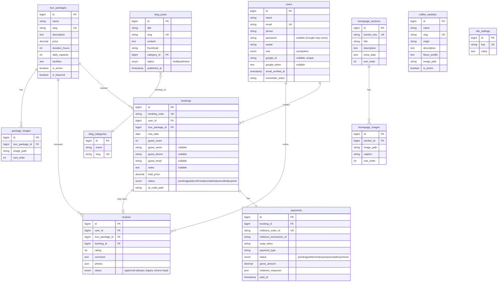

# TRD — Technical Requirements Document
# E-Tourism Information System for CV Kopi Danau Atas

> **Version:** 2.0 (major revision) | **Date:** May 23, 2026
> **Author:** Fadhil Dzaky Arhab — 2301092010

---

## Changelog (v1.0 → v2.0)

This is a major revision that aligns the TRD with the implementation
that has been delivered. Items below describe **what changed since v1.0**:

- **§1 Tech stack** updated to match `composer.json` / `package.json`:
  Laravel **11.x** (not 12), Vite **^8.0**, plus newly-adopted packages
  (`laravel/socialite`, `barryvdh/laravel-dompdf`).
- **§3 ERD / §4 Schema** — added the new columns introduced after v1.0:
  `users.google_id`, `users.google_token`, `users.password` made
  nullable; `bookings.guest_name`, `bookings.guest_phone`,
  `bookings.guest_email`, `bookings.notes`.
- **§5 Routes** — added: Google OAuth routes, email verification
  endpoints, `/booking/create` (Review Order), `/booking/{id}/update-status`
  (client polling fallback), `/booking/{id}/invoice` (PDF download).
- **§6 Midtrans** — documented the `MidtransService` class and the
  client-polling fallback path.
- **§7 Quota** — formula updated to match the actual implementation
  (paid|confirmed|completed plus pending<1h). Added §7.3 Auto-Complete
  scheduled command.
- **§8 Filament** — Review resource is read-only (no approve/reject).
  Stats widget shows total reviews, not pending. `UpcomingQuotaWidget`
  documented. Booking trend / revenue charts moved to roadmap.
- **§9 Localization** — `lang/id.json` & `lang/en.json` are the
  primary translation files; subdirectory PHP files only for built-in
  Laravel messages.
- **§10 Folder structure** — added `app/Console/Commands/AutoCompleteBookings.php`,
  `resources/views/pdf/`, `resources/views/emails/booking/`,
  `app/Http/Controllers/Auth/GoogleController.php`.
- **§11 Dependencies** — locked versions reflect the real
  `composer.json` / `package.json`.
- **§14 Testing** — Black-Box scenarios extended for Google OAuth,
  email verification, Review Order step, invoice download, and the
  status polling fallback.

---

## 1. Tech Stack

| Layer | Technology | Version |
|-------|------------|---------|
| Backend Framework | Laravel | 11.x |
| Admin Panel | Filament PHP | 3.3 |
| OAuth | Laravel Socialite (Google driver) | ^5.27 |
| PDF Generation | barryvdh/laravel-dompdf | ^3.1 |
| QR Code | simplesoftwareio/simple-qrcode | ^4.2 |
| Media Library | spatie/laravel-medialibrary | ^11.22 |
| Slug | spatie/laravel-sluggable | ^3.8 |
| Payment SDK | midtrans/midtrans-php | ^2.6 |
| Database | MySQL (MariaDB) | 10.4+ |
| Frontend | Blade + Vite + Alpine.js | — |
| CSS | Tailwind CSS | 4.x |
| Build Tool | Vite | ^8.0 |
| Vite Plugin | laravel-vite-plugin | ^3.0 |
| Maps | Google Maps Embed API | — |
| Language | PHP | 8.3+ |
| Server | Apache / Nginx | — |

Dev tooling: `laravel/pail`, `laravel/pint`, `phpunit/phpunit ^12.5`,
`mockery/mockery`, `nunomaduro/collision`, `fakerphp/faker`.

---

## 2. System Architecture

```
┌─────────────┐     ┌──────────────────┐     ┌──────────────┐
│   Browser    │────▶│   Laravel App    │────▶│    MySQL     │
│  (Visitor)   │◀────│  (Blade + API)   │◀────│   Database   │
└─────────────┘     └────────┬─────────┘     └──────────────┘
                             │
              ┌──────────────┼──────────────┐
              ▼              ▼              ▼
        ┌──────────┐  ┌─────────────┐  ┌──────────┐
        │ Midtrans │  │ Google OAuth│  │ Storage  │
        │   API    │  │  + Maps API │  │ (images, │
        │          │  │             │  │ qr, pdf) │
        └──────────┘  └─────────────┘  └──────────┘
                             │
                       ┌─────▼─────┐
                       │   SMTP    │
                       │ (queued)  │
                       └───────────┘
```

- **Architecture Pattern:** MVC (Model-View-Controller) — Laravel
  built-in.
- **Admin Panel:** Filament PHP (auto-generates CRUD from Eloquent
  Models) at `/admin`.
- **Public Frontend:** Server-side rendered via Blade templates +
  Alpine.js for interactivity.
- **Background work:** Laravel scheduler runs two custom commands
  (expire pending, auto-complete past visits). Email sending is
  dispatched to the queue.

---

## 3. Entity Relationship Diagram (ERD)



---

## 4. Database Tables Detail

### 4.1 `users`

| Column | Type | Constraint | Description |
|--------|------|------------|-------------|
| id | BIGINT | PK, AI | — |
| name | VARCHAR(255) | NOT NULL | Full name |
| email | VARCHAR(255) | UNIQUE, NOT NULL | Login email |
| phone | VARCHAR(20) | NULLABLE | Phone number |
| password | VARCHAR(255) | **NULLABLE** | Bcrypt hash (null for Google-only users) |
| avatar | VARCHAR(255) | NULLABLE | Profile photo path / Google avatar URL |
| role | ENUM('user','admin') | DEFAULT 'user' | Access level |
| google_id | VARCHAR(255) | NULLABLE, UNIQUE | Google subject ID |
| google_token | TEXT | NULLABLE | OAuth access token |
| email_verified_at | TIMESTAMP | NULLABLE | Verification timestamp |
| remember_token | VARCHAR(100) | NULLABLE | Session token |
| created_at / updated_at | TIMESTAMPS | — | — |

### 4.2 `tour_packages`

| Column | Type | Constraint | Description |
|--------|------|------------|-------------|
| id | BIGINT | PK, AI | — |
| name | VARCHAR(255) | NOT NULL | Package name |
| slug | VARCHAR(255) | UNIQUE | URL-friendly identifier (auto-generated) |
| description | TEXT | NOT NULL | Full description |
| price | DECIMAL(12,2) | NOT NULL | Price per person (IDR) |
| duration_hours | INT | NOT NULL | Duration in hours |
| daily_capacity | INT | NOT NULL | Daily quota |
| facilities | TEXT | NULLABLE | Free-form list of facilities |
| is_active | BOOLEAN | DEFAULT true | Visible on site |
| is_featured | BOOLEAN | DEFAULT false | Shown on homepage |
| created_at / updated_at | TIMESTAMPS | — | — |

### 4.3 `bookings`

| Column | Type | Constraint | Description |
|--------|------|------------|-------------|
| id | BIGINT | PK, AI | — |
| booking_code | VARCHAR(20) | UNIQUE | Format: KDA-YYYYMMDD-XXXXX |
| user_id | BIGINT | FK → users (cascade) | Account holder |
| tour_package_id | BIGINT | FK → tour_packages (cascade) | Selected package |
| visit_date | DATE | NOT NULL | Visit date (min D+1) |
| guest_count | INT | NOT NULL | Number of guests |
| guest_name | VARCHAR(255) | NULLABLE | Captured at Review Order step |
| guest_phone | VARCHAR(30) | NULLABLE | Captured at Review Order step |
| guest_email | VARCHAR(255) | NULLABLE | Captured at Review Order step |
| notes | TEXT | NULLABLE | Optional special requests |
| total_price | DECIMAL(12,2) | NOT NULL | price × guest_count |
| status | ENUM | DEFAULT 'pending' | pending / paid / confirmed / completed / cancelled / expired |
| qr_code_path | VARCHAR(255) | NULLABLE | QR code e-ticket path |
| created_at / updated_at | TIMESTAMPS | — | — |

**Composite Index:** `(tour_package_id, visit_date, status)` —
optimises the daily quota query.

### 4.4 `payments`

| Column | Type | Constraint | Description |
|--------|------|------------|-------------|
| id | BIGINT | PK, AI | — |
| booking_id | BIGINT | FK → bookings | 1:1 relation |
| midtrans_order_id | VARCHAR(50) | UNIQUE | Midtrans order ID |
| midtrans_transaction_id | VARCHAR(50) | NULLABLE | From Midtrans response |
| snap_token | VARCHAR(255) | NULLABLE | Snap popup token |
| payment_type | VARCHAR(50) | NULLABLE | bank_transfer / gopay / etc. |
| status | VARCHAR(20) | DEFAULT 'pending' | Status from Midtrans |
| gross_amount | DECIMAL(12,2) | NOT NULL | Total payment amount |
| midtrans_response | JSON | NULLABLE | Full webhook payload |
| paid_at | TIMESTAMP | NULLABLE | Successful payment timestamp |
| created_at / updated_at | TIMESTAMPS | — | — |

### 4.5 `reviews`

| Column | Type | Constraint | Description |
|--------|------|------------|-------------|
| id | BIGINT | PK, AI | — |
| user_id | BIGINT | FK → users (cascade) | Reviewer |
| tour_package_id | BIGINT | FK → tour_packages (cascade) | Reviewed package |
| booking_id | BIGINT | FK → bookings (cascade) | Booking that earned the right to review |
| rating | TINYINT | NOT NULL | 1–5 |
| comment | TEXT | NOT NULL | Min 10 characters |
| photos | JSON | NULLABLE | Up to 3 photo paths |
| status | ENUM('pending','approved','rejected') | DEFAULT 'pending' | **Always set to `approved` in v2.0** (kept for backward compatibility) |
| created_at / updated_at | TIMESTAMPS | — | — |

> The `status` column is intentionally retained in v2.0 even though it
> always equals `approved`. Future schema cleanup may drop or repurpose
> it.

---

## 5. API & Route Structure

### 5.1 Public Routes (Web)

```php
// Public pages
GET  /                          → HomeController@index
GET  /paket-wisata              → TourPackageController@index
GET  /paket-wisata/{slug}       → TourPackageController@show
GET  /blog                      → BlogController@index
GET  /blog/{slug}               → BlogController@show
GET  /lang/{locale}             → LocaleController@switch

// Authentication (guest middleware)
GET  /masuk                     → Auth\LoginController@showForm
POST /masuk                     → Auth\LoginController@login
GET  /daftar                    → Auth\RegisterController@showForm
POST /daftar                    → Auth\RegisterController@register

// Google OAuth (guest middleware)
GET  /auth/google/redirect      → Auth\GoogleController@redirectToGoogle
GET  /auth/google/callback      → Auth\GoogleController@handleGoogleCallback

// Password reset (guest middleware)
GET  /lupa-password             → Auth\ForgotPasswordController@showForm
POST /lupa-password             → Auth\ForgotPasswordController@sendLink
GET  /reset-password/{token}    → Auth\ResetPasswordController@showForm
POST /reset-password            → Auth\ResetPasswordController@update

POST /logout                    → Auth\LoginController@logout (auth)
```

### 5.2 Email Verification Routes (auth middleware)

```php
GET  /email/verify              → verification.notice (closure view)
GET  /email/verify/{id}/{hash}  → fulfill verification (signed)
POST /email/verification-notification → resend verification (throttle:6,1)
```

### 5.3 Authenticated Routes (middleware: auth + verified)

```php
// Booking
GET  /booking                       → BookingController@myBookings
POST /booking/create                → BookingController@create   (Review Order page)
POST /booking                       → BookingController@store
GET  /booking/{booking}             → BookingController@show
GET  /booking/{booking}/invoice     → InvoiceController@download (PDF)

// Payment
GET  /booking/{booking}/bayar       → PaymentController@checkout
POST /booking/{booking}/pay         → PaymentController@createSnapToken
POST /booking/{booking}/update-status → PaymentController@updateStatus
                                       (client polling fallback when webhook is delayed)

// Review
POST /booking/{booking}/review      → ReviewController@store

// Profile
GET  /profil                        → ProfileController@edit
PUT  /profil                        → ProfileController@update
```

### 5.4 Public AJAX

```php
GET /api/kuota/{packageId}/{date}   → BookingController@checkQuota
```

### 5.5 Midtrans Webhook (no auth, signature-verified)

```php
POST /api/midtrans/notification → MidtransWebhookController@handle
```

### 5.6 Admin Routes (Filament — auto-generated)

```
/admin                          → Filament Dashboard
/admin/tour-packages            → TourPackageResource
/admin/bookings                 → BookingResource
/admin/payments                 → PaymentResource
/admin/blog-posts               → BlogPostResource
/admin/blog-categories          → BlogCategoryResource
/admin/reviews                  → ReviewResource (read-only + delete)
/admin/homepage-sections        → HomepageSectionResource
/admin/coffee-varieties         → CoffeeVarietyResource
/admin/users                    → UserResource
/admin/site-settings            → SiteSettingResource
```

---

## 6. Midtrans Integration

### 6.1 Configuration

```env
# .env
MIDTRANS_SERVER_KEY=SB-Mid-server-xxxxx
MIDTRANS_CLIENT_KEY=SB-Mid-client-xxxxx
MIDTRANS_IS_PRODUCTION=false
MIDTRANS_MERCHANT_ID=G00000000
```

`config/midtrans.php` also derives the Snap script URL from
`MIDTRANS_IS_PRODUCTION` so the client loads the correct sandbox or
production `snap.js`.

### 6.2 Service Layer (`app/Services/MidtransService.php`)

The service centralises all Midtrans interaction:

- `createSnapToken(Booking $booking): string` — builds transaction
  params (uses `guest_*` fields when present, falls back to the user's
  account fields), calls `Snap::getSnapToken()`, and persists/updates a
  `Payment` row keyed by `booking_id`. Returns the Snap token.
- `verifySignature(array $notification): bool` — verifies the SHA-512
  signature key per Midtrans spec.
- `handleNotification(array $notification): void` — looks up the
  payment by `midtrans_order_id`, updates `transaction_id`,
  `payment_type`, and the raw response, then transitions the booking
  status based on `transaction_status`.
- `finalizePaidBooking(Booking $booking): void` — runs idempotent
  side-effects (QR code generation + queued confirmation email) only
  when the booking transitions into the paid state for the first time.
  Errors are logged but never re-thrown so a flaky SMTP server cannot
  cause Midtrans to retry the webhook.

### 6.3 Payment Flow

```
1. User clicks "Pay" on the booking page
2. Frontend POSTs /booking/{id}/pay
3. PaymentController calls MidtransService::createSnapToken(booking)
4. MidtransService:
   - composes order_id ("KDA-{bookingId}-{time()}")
   - calls Midtrans Snap API to obtain snap_token
   - upserts the Payment record keyed by booking_id
5. Frontend receives snap_token and invokes snap.pay(snapToken)
6. User completes payment in the Snap popup/redirect
7. Midtrans sends a webhook to /api/midtrans/notification
8. MidtransWebhookController verifies signature → handleNotification:
   - settlement → booking.status = 'paid', generate QR, queue email
   - expire    → booking.status = 'expired'
   - cancel/deny/refund → booking.status = 'cancelled'
   - pending   → payment.status = 'pending'
9. (Fallback) If the user reaches /booking/{id} but the webhook is
   delayed, the page may POST to /booking/{id}/update-status, which
   queries Midtrans Transaction::status() and re-runs handleNotification
   locally.
```

### 6.4 Webhook Handler Logic (simplified)

```php
public function handle(Request $request, MidtransService $midtrans)
{
    $notification = $request->all();

    if (! $midtrans->verifySignature($notification)) {
        return response('Invalid signature', 403);
    }

    $midtrans->handleNotification($notification);

    return response('OK', 200);
}
```

---

## 7. Daily Quota Management

### 7.1 Available Quota Query

The implementation lives on `TourPackage::getAvailableQuota`. It is
intentionally stricter than the v1.0 spec to prevent double-booking
during the payment window:

```php
public function getAvailableQuota(string $date): int
{
    $bookedCount = $this->bookings()
        ->where('visit_date', $date)
        ->where(function ($q) {
            $q->whereIn('status', ['paid', 'confirmed', 'completed'])
              ->orWhere(function ($q2) {
                  $q2->where('status', 'pending')
                     ->where('created_at', '>=', now()->subHour());
              });
        })
        ->sum('guest_count');

    return max(0, $this->daily_capacity - (int) $bookedCount);
}
```

`BookingController::store` re-runs this check inside a database
transaction with `lockForUpdate()` on the parent `tour_packages` row to
serialise concurrent bookings on the same package.

### 7.2 Auto-Expire Pending Bookings

```php
// app/Console/Commands/ExpirePendingBookings.php
// Scheduled in routes/console.php every 15 minutes.
Booking::where('status', 'pending')
    ->where('created_at', '<', now()->subHour())
    ->update(['status' => 'expired']);
```

### 7.3 Auto-Complete Past Bookings

```php
// app/Console/Commands/AutoCompleteBookings.php
// Scheduled in routes/console.php daily at 23:55.
Booking::whereIn('status', ['paid', 'confirmed'])
    ->whereDate('visit_date', '<', today())
    ->update(['status' => 'completed']);
```

This unblocks the "Write Review" CTA on the user's My Bookings page.

---

## 8. Filament Admin Resources

### 8.1 Resource List

| Resource | Model | Notes |
|----------|-------|-------|
| TourPackageResource | TourPackage | CRUD, multi-image repeater, toggle is_active / is_featured |
| BookingResource | Booking | List, filter (status / date / package), edit `status`, view detail incl. guest fields |
| PaymentResource | Payment | Read-only; status filter; raw `midtrans_response` viewable |
| BlogPostResource | BlogPost | CRUD, rich text editor, category, draft/published, SEO fields |
| BlogCategoryResource | BlogCategory | Simple CRUD |
| **ReviewResource** | Review | **Read-only inspect + delete only** (no approve/reject — see §4.6 of PRD). Bulk delete supported. |
| HomepageSectionResource | HomepageSection | Edit content per homepage section + image gallery |
| CoffeeVarietyResource | CoffeeVariety | CRUD coffee variety catalog (admin-only in v2.0) |
| UserResource | User | List, detail, history. Block/unblock is on roadmap. |
| SiteSettingResource | SiteSetting | Key/value CRUD |

### 8.2 Dashboard Widgets

| Widget | Type | Content |
|--------|------|---------|
| StatsOverviewWidget | Stats cards | Bookings today (with month total in description), Revenue this month (settlement), Registered users, **Total reviews**. Cached for 60 seconds. |
| LatestBookingsWidget | Table | 5 most recent bookings with status badge |
| UpcomingQuotaWidget | Custom view | Per-package quota utilisation for the next 7 days. Uses a single grouped aggregate query to avoid N×M lookups. |
| _Roadmap_ BookingChartWidget | Line chart | Booking trend per week (deferred) |
| _Roadmap_ RevenueChartWidget | Bar chart | Revenue per month (deferred) |

---

## 9. Localization (Multi-Language)

### 9.1 File Structure

```
lang/
├── id.json              // Indonesian UI labels (primary)
├── en.json              // English UI labels (primary)
├── id/
│   ├── auth.php         // Laravel built-in auth messages
│   ├── pagination.php
│   └── validation.php
└── en/
    ├── auth.php
    ├── pagination.php
    └── validation.php
```

### 9.2 Implementation

```php
// LocaleController.php
public function switch(string $locale)
{
    if (in_array($locale, ['id', 'en'])) {
        session(['locale' => $locale]);
    }
    return redirect()->back();
}

// app/Http/Middleware/SetLocale.php (registered globally)
public function handle($request, Closure $next)
{
    $locale = session('locale', config('app.locale'));
    if (in_array($locale, ['id', 'en'])) {
        app()->setLocale($locale);
    }
    return $next($request);
}
```

```blade
{{-- Blade template usage --}}
<a href="/paket-wisata">{{ __('Tour Packages') }}</a>
<button>{{ __('Book Now') }}</button>
```

---

## 10. Project Folder Structure

```
ta_laravel/
├── app/
│   ├── Console/Commands/
│   │   ├── ExpirePendingBookings.php
│   │   └── AutoCompleteBookings.php
│   ├── Filament/
│   │   ├── Resources/                 # All Filament resources (10)
│   │   └── Widgets/
│   │       ├── StatsOverviewWidget.php
│   │       ├── LatestBookingsWidget.php
│   │       └── UpcomingQuotaWidget.php
│   ├── Http/
│   │   ├── Controllers/
│   │   │   ├── HomeController.php
│   │   │   ├── TourPackageController.php
│   │   │   ├── BlogController.php
│   │   │   ├── BookingController.php
│   │   │   ├── PaymentController.php
│   │   │   ├── ReviewController.php
│   │   │   ├── InvoiceController.php
│   │   │   ├── ProfileController.php
│   │   │   ├── LocaleController.php
│   │   │   ├── MidtransWebhookController.php
│   │   │   └── Auth/
│   │   │       ├── LoginController.php
│   │   │       ├── RegisterController.php
│   │   │       ├── GoogleController.php
│   │   │       ├── ForgotPasswordController.php
│   │   │       └── ResetPasswordController.php
│   │   └── Middleware/
│   │       └── SetLocale.php
│   ├── Mail/
│   │   └── BookingConfirmation.php
│   ├── Models/                        # Eloquent models (12)
│   ├── Providers/
│   │   ├── AppServiceProvider.php
│   │   └── Filament/
│   └── Services/
│       ├── MidtransService.php
│       └── QrCodeService.php
├── config/
│   └── midtrans.php
├── database/
│   ├── migrations/                    # All migration files
│   ├── seeders/
│   └── factories/
├── lang/
│   ├── id.json                        # Indonesian UI labels
│   ├── en.json                        # English UI labels
│   └── id|en/{auth,pagination,validation}.php
├── public/
│   ├── images/
│   └── storage -> ../storage/app/public
├── resources/
│   ├── css/app.css
│   ├── js/app.js
│   └── views/
│       ├── layouts/
│       │   ├── app.blade.php
│       │   └── guest.blade.php
│       ├── components/
│       ├── pages/
│       │   ├── home.blade.php
│       │   ├── packages/
│       │   ├── blog/
│       │   ├── booking/
│       │   ├── auth/
│       │   └── profile/
│       ├── partials/
│       │   ├── navbar.blade.php
│       │   ├── footer.blade.php
│       │   └── breadcrumbs.blade.php
│       ├── pdf/
│       │   └── invoice.blade.php       # DomPDF template
│       ├── emails/
│       │   └── booking/                # BookingConfirmation mailable
│       └── filament/
│           └── widgets/                # Custom widget views
├── routes/
│   ├── web.php                        # Public + auth routes
│   ├── api.php                        # Midtrans webhook
│   └── console.php                    # Scheduler
├── storage/app/public/
│   ├── packages/
│   ├── blog/
│   ├── reviews/
│   ├── homepage/
│   ├── avatars/
│   └── qrcodes/
└── tests/
    ├── Feature/
    └── Unit/
```

---

## 11. Package Dependencies

### 11.1 Composer (PHP) — `composer.json`

```json
{
  "require": {
    "php": "^8.3",
    "barryvdh/laravel-dompdf": "^3.1",
    "filament/filament": "3.3",
    "laravel/framework": "^11.0",
    "laravel/socialite": "^5.27",
    "laravel/tinker": "^3.0",
    "midtrans/midtrans-php": "^2.6",
    "simplesoftwareio/simple-qrcode": "^4.2",
    "spatie/laravel-medialibrary": "^11.22",
    "spatie/laravel-sluggable": "^3.8"
  },
  "require-dev": {
    "fakerphp/faker": "^1.23",
    "laravel/pail": "^1.2.5",
    "laravel/pint": "^1.27",
    "mockery/mockery": "^1.6",
    "nunomaduro/collision": "^8.6",
    "phpunit/phpunit": "^12.5.12"
  }
}
```

| Package | Purpose |
|---------|---------|
| laravel/framework | App framework (Laravel 11) |
| filament/filament | Admin panel |
| midtrans/midtrans-php | Payment SDK |
| laravel/socialite | OAuth (Google) |
| barryvdh/laravel-dompdf | PDF invoice generation |
| simplesoftwareio/simple-qrcode | QR code for e-tickets |
| spatie/laravel-medialibrary | Multi-image upload & management |
| spatie/laravel-sluggable | Auto-generated slugs |
| laravel/tinker | REPL for development/debugging |

### 11.2 NPM (Frontend) — `package.json`

```json
{
  "devDependencies": {
    "@tailwindcss/vite": "^4.0.0",
    "concurrently": "^9.0.1",
    "laravel-vite-plugin": "^3.0.0",
    "tailwindcss": "^4.0.0",
    "vite": "^8.0.0"
  }
}
```

---

## 12. Security

| Aspect | Implementation |
|--------|----------------|
| **CSRF** | Laravel CSRF token on all POST forms |
| **XSS** | Blade `{{ }}` auto-escape; user input sanitised |
| **SQL Injection** | Eloquent ORM (prepared statements only) |
| **Password** | Bcrypt hashing; nullable for Google-only users |
| **Email verification** | Signed URL middleware + `MustVerifyEmail` contract on `User` |
| **Midtrans** | SHA-512 signature key verification on every webhook |
| **OAuth** | Socialite with verified Google client; account linking by email |
| **Auth** | Laravel built-in auth + Filament guard for admin (`isAdmin()` + `canAccessPanel()`) |
| **File upload** | File type & size validation; stored under `storage/app/public/...` |
| **Rate limiting** | Throttle on email-verification resend (`throttle:6,1`) |
| **Authorisation** | `abort_if($booking->user_id !== auth()->id(), 403)` enforced on all booking-scoped controllers |

---

## 13. Deployment

### 13.1 Minimum Server Specifications

| Component | Minimum |
|-----------|---------|
| OS | Ubuntu 22.04 LTS / CentOS 8 |
| PHP | 8.3+ (with ext: pdo_mysql, mbstring, openssl, gd, zip, intl) |
| MySQL/MariaDB | 10.4+ |
| RAM | 2 GB |
| Storage | 20 GB SSD |
| Web Server | Nginx / Apache |
| Queue Worker | `php artisan queue:work` (systemd or supervisor) |
| Scheduler | `* * * * * cd /path && php artisan schedule:run >> /dev/null 2>&1` |

### 13.2 Production Environment Variables

```env
APP_ENV=production
APP_DEBUG=false
APP_URL=https://kopidanauatas.com

DB_CONNECTION=mysql
DB_HOST=127.0.0.1
DB_PORT=3306
DB_DATABASE=etourism_kda
DB_USERNAME=kda_user
DB_PASSWORD=*****

MIDTRANS_SERVER_KEY=Mid-server-xxxxx
MIDTRANS_CLIENT_KEY=Mid-client-xxxxx
MIDTRANS_IS_PRODUCTION=true
MIDTRANS_MERCHANT_ID=Mxxxxx

GOOGLE_CLIENT_ID=*****
GOOGLE_CLIENT_SECRET=*****
GOOGLE_REDIRECT_URL=https://kopidanauatas.com/auth/google/callback

QUEUE_CONNECTION=database   # or redis if available
MAIL_MAILER=smtp
MAIL_HOST=...
MAIL_PORT=587
MAIL_USERNAME=...
MAIL_PASSWORD=...
MAIL_ENCRYPTION=tls
MAIL_FROM_ADDRESS="noreply@kopidanauatas.com"
MAIL_FROM_NAME="${APP_NAME}"
```

### 13.3 Deploy Checklist

```
composer install --no-dev --optimize-autoloader
php artisan migrate --force
php artisan storage:link
php artisan config:cache
php artisan route:cache
php artisan view:cache
php artisan icons:cache
php artisan filament:optimize
npm ci && npm run build
# Restart queue worker (systemd / supervisor)
```

---

## 14. Testing (Black Box Testing)

### 14.1 Test Scenarios

| ID | Module | Scenario | Input | Expected Output |
|----|--------|----------|-------|-----------------|
| T-01 | Registration | Register new account (email/password) | Valid data | Account created; redirected to **Verify Email notice** |
| T-02 | Registration | Duplicate email | Existing email | Error: "Email already in use" |
| T-03 | Email verify | Click verification link | Signed link | `email_verified_at` set; redirected to home |
| T-04 | Email verify | Resend verification | Click "resend" | Throttle 6 / minute enforced |
| T-05 | Login | Valid credentials | Correct email + password | Redirect to homepage (authenticated) |
| T-06 | Login | Wrong password | Incorrect password | Error: "Invalid credentials" |
| T-07 | Google OAuth | New user via Google | Allow consent | Account created with `email_verified_at = now()`; logged in |
| T-08 | Google OAuth | Existing email via Google | Allow consent | Account linked (`google_id` updated); logged in |
| T-09 | Booking | Book with available quota | Valid date + count | Booking created at `pending`; redirected to checkout |
| T-10 | Booking | Review Order step | Submit guest data + T&C | Booking persisted with guest fields populated |
| T-11 | Booking | Without T&C | Submit unchecked | Validation error |
| T-12 | Booking | Full quota | Count > remaining | Error: "Insufficient quota" |
| T-13 | Booking | Past date | Yesterday's date | Validation error: must be after today |
| T-14 | Payment | Pay via Snap | Click pay | Snap popup with payment methods |
| T-15 | Payment | Successful payment | Simulate settlement | Booking → `paid`; QR generated; email queued |
| T-16 | Payment | Polling fallback | Click "refresh status" | `update-status` re-syncs without webhook |
| T-17 | Payment | Expired | No payment > 1 hour | Booking → `expired`; quota freed |
| T-18 | Webhook | Invalid signature | Tampered payload | 403 Invalid signature |
| T-19 | Auto-complete | Past visit date | Run scheduler | Booking → `completed` |
| T-20 | Review | Submit review (completed) | Rating + comment | Review saved; **status `approved` (auto)** |
| T-21 | Review | Submit review (not completed) | — | 403; review form not shown |
| T-22 | Admin | Delete review | Click delete | Review removed from listing & public |
| T-23 | Admin | CRUD tour package | Package data | Package saved/updated/deleted |
| T-24 | Admin | Edit booking status | Change status | Status persisted (manual transition) |
| T-25 | Blog | Admin publishes article | Article + publish | Article visible on blog page |
| T-26 | Language | Toggle ID → EN | Click EN | UI labels switch to English; persisted in session |
| T-27 | Responsive | Access via mobile | Open on smartphone | Layout adapts to mobile screen |
| T-28 | Maps | View location map | Open homepage | Google Maps embed with location pin |
| T-29 | Quota | Real-time quota check | Select a date | Remaining quota displayed accurately |
| T-30 | Invoice | Download invoice | Paid booking | PDF downloaded with booking_code in filename |

---

## 15. Verification Plan

```
1. Run all migrations without errors
   → php artisan migrate --force

2. Seed demo data (admin user, tour packages, sample blog posts,
   homepage sections, site settings)
   → php artisan db:seed

3. Configure .env (Midtrans Sandbox + Google OAuth Sandbox + SMTP)

4. Test public endpoints (homepage, packages, blog) via browser

5. Test end-to-end booking flow in Midtrans Sandbox
   → Use test card: 4811 1111 1111 1114

6. Verify Midtrans webhook (use the Midtrans simulator)

7. Verify Midtrans polling fallback
   → POST /booking/{id}/update-status while webhook is "paused"

8. Test Google OAuth (Sandbox client) for both new-user and
   existing-email-link paths

9. Test email verification (open Mailpit / log driver and click link)

10. Test responsiveness in Chrome DevTools (mobile, tablet, desktop)

11. Test language toggle ID ↔ EN

12. Test Filament admin panel (all CRUD resources, including
    read-only Review form + delete action)

13. Trigger scheduled commands manually
    → php artisan bookings:expire-pending
    → php artisan bookings:auto-complete

14. Execute Black Box Testing per §14.1
```
