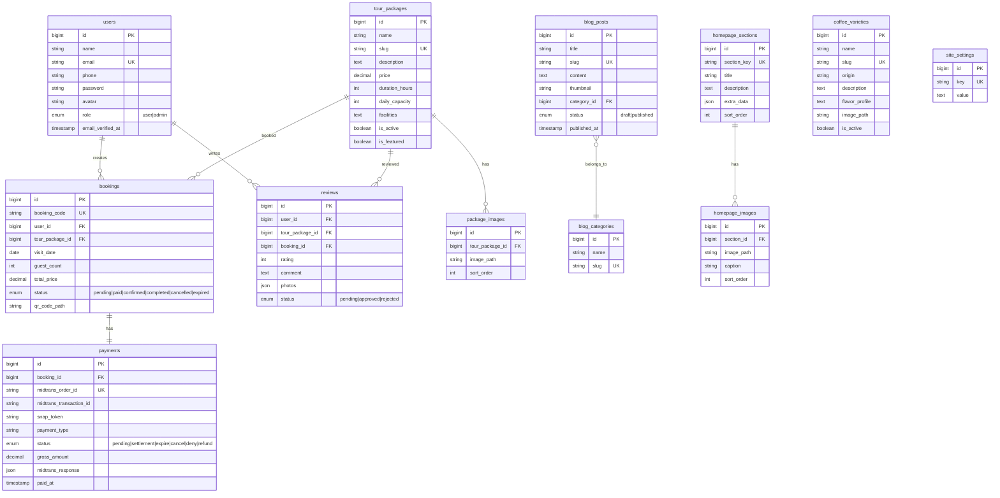

# TRD — Technical Requirements Document
# E-Tourism Information System for CV Kopi Danau Atas

> **Version:** 1.0 | **Date:** May 2, 2026  
> **Author:** Fadhil Dzaky Arhab — 2301092010

---

## 1. Tech Stack

| Layer | Technology | Version |
|-------|------------|---------|
| Backend Framework | Laravel | 12.x |
| Admin Panel | Filament PHP | 3.3 |
| Database | MySQL (MariaDB) | 10.4+ |
| Frontend | Blade + Vite + Alpine.js | - |
| CSS | Tailwind CSS | 4.x |
| Payment Gateway | Midtrans Snap | v2 |
| Maps | Google Maps Embed API | - |
| Language | PHP | 8.3+ |
| Server | Apache / Nginx | - |

---

## 2. System Architecture

```
┌─────────────┐     ┌──────────────────┐     ┌──────────────┐
│   Browser    │────▶│   Laravel App    │────▶│    MySQL     │
│  (Visitor)   │◀────│  (Blade + API)   │◀────│   Database   │
└─────────────┘     └────────┬─────────┘     └──────────────┘
                             │
                    ┌────────┼─────────┐
                    ▼        ▼         ▼
              ┌──────┐ ┌─────────┐ ┌────────┐
              │Midtrans│ │Google   │ │Storage │
              │  API   │ │Maps API │ │(images)│
              └──────┘ └─────────┘ └────────┘
```

- **Architecture Pattern:** MVC (Model-View-Controller) — Laravel built-in
- **Admin Panel:** Filament PHP (auto-generates CRUD from Eloquent Models)
- **Public Frontend:** Server-side rendered via Blade templates + Alpine.js for interactivity

---

## 3. Entity Relationship Diagram (ERD)



---

## 4. Database Tables Detail

### 4.1 `users`

| Column | Type | Constraint | Description |
|--------|------|------------|-------------|
| id | BIGINT | PK, AI | Auto-increment |
| name | VARCHAR(255) | NOT NULL | Full name |
| email | VARCHAR(255) | UNIQUE, NOT NULL | Login email |
| phone | VARCHAR(20) | NULLABLE | Phone number |
| password | VARCHAR(255) | NOT NULL | Bcrypt hash |
| avatar | VARCHAR(255) | NULLABLE | Profile photo path |
| role | ENUM('user','admin') | DEFAULT 'user' | Access level |
| email_verified_at | TIMESTAMP | NULLABLE | Verification date |
| remember_token | VARCHAR(100) | NULLABLE | Session token |
| created_at / updated_at | TIMESTAMPS | — | — |

### 4.2 `tour_packages`

| Column | Type | Constraint | Description |
|--------|------|------------|-------------|
| id | BIGINT | PK, AI | — |
| name | VARCHAR(255) | NOT NULL | Package name |
| slug | VARCHAR(255) | UNIQUE | URL-friendly identifier |
| description | TEXT | NOT NULL | Full description |
| price | DECIMAL(12,2) | NOT NULL | Price per person (IDR) |
| duration_hours | INT | NOT NULL | Duration in hours |
| daily_capacity | INT | NOT NULL | Daily quota |
| facilities | TEXT | NULLABLE | JSON list of facilities |
| is_active | BOOLEAN | DEFAULT true | Visible on site |
| is_featured | BOOLEAN | DEFAULT false | Shown on homepage |
| created_at / updated_at | TIMESTAMPS | — | — |

### 4.3 `bookings`

| Column | Type | Constraint | Description |
|--------|------|------------|-------------|
| id | BIGINT | PK, AI | — |
| booking_code | VARCHAR(20) | UNIQUE | Format: KDA-YYYYMMDD-XXXXX |
| user_id | BIGINT | FK → users | Booker reference |
| tour_package_id | BIGINT | FK → tour_packages | Selected package |
| visit_date | DATE | NOT NULL | Visit date (min D+1) |
| guest_count | INT | NOT NULL | Number of guests |
| total_price | DECIMAL(12,2) | NOT NULL | price × guest_count |
| status | ENUM | DEFAULT 'pending' | pending / paid / confirmed / completed / cancelled / expired |
| qr_code_path | VARCHAR(255) | NULLABLE | QR code e-ticket path |
| created_at / updated_at | TIMESTAMPS | — | — |

**Composite Index:** `(tour_package_id, visit_date, status)` — optimizes daily quota queries

### 4.4 `payments`

| Column | Type | Constraint | Description |
|--------|------|------------|-------------|
| id | BIGINT | PK, AI | — |
| booking_id | BIGINT | FK → bookings | 1:1 relation |
| midtrans_order_id | VARCHAR(50) | UNIQUE | Midtrans order ID |
| midtrans_transaction_id | VARCHAR(50) | NULLABLE | From Midtrans response |
| snap_token | VARCHAR(255) | NULLABLE | Snap popup token |
| payment_type | VARCHAR(50) | NULLABLE | bank_transfer / gopay / etc. |
| status | VARCHAR(20) | DEFAULT 'pending' | Status from Midtrans |
| gross_amount | DECIMAL(12,2) | NOT NULL | Total payment amount |
| midtrans_response | JSON | NULLABLE | Full response JSON |
| paid_at | TIMESTAMP | NULLABLE | Successful payment timestamp |
| created_at / updated_at | TIMESTAMPS | — | — |

---

## 5. API & Route Structure

### 5.1 Public Routes (Web)

```php
// Public pages
GET  /                          → HomeController@index
GET  /paket-wisata              → TourPackageController@index
GET  /paket-wisata/{slug}       → TourPackageController@show
GET  /blog                      → BlogController@index
GET  /blog/{slug}               → BlogController@show
GET  /lang/{locale}             → LocaleController@switch

// Authentication
GET  /masuk                     → LoginController@showForm
POST /masuk                     → LoginController@login
GET  /daftar                    → RegisterController@showForm
POST /daftar                    → RegisterController@register
POST /logout                    → LoginController@logout
GET  /lupa-password             → ForgotPasswordController@showForm
POST /lupa-password             → ForgotPasswordController@sendReset
```

### 5.2 Authenticated Routes (middleware: auth)

```php
// Booking
POST /booking                   → BookingController@store
GET  /booking                   → BookingController@myBookings
GET  /booking/{id}              → BookingController@show
POST /booking/{id}/pay          → PaymentController@createSnapToken
GET  /booking/{id}/pay          → PaymentController@checkout

// Review
POST /booking/{id}/review       → ReviewController@store

// Profile
GET  /profil                    → ProfileController@edit
PUT  /profil                    → ProfileController@update

// AJAX API
GET  /api/kuota/{packageId}/{date}  → QuotaController@check
```

### 5.3 Midtrans Webhook

```php
POST /api/midtrans/notification → MidtransWebhookController@handle
```

> No auth middleware required. Validated via **Midtrans Signature Key**.

### 5.4 Admin Routes (Filament — auto-generated)

```
/admin                          → Filament Dashboard
/admin/tour-packages            → Manage Tour Packages
/admin/bookings                 → Manage Bookings
/admin/payments                 → Manage Payments
/admin/blog-posts               → Manage Blog Posts
/admin/blog-categories          → Manage Blog Categories
/admin/reviews                  → Manage Reviews
/admin/homepage-sections        → Manage Homepage Content
/admin/coffee-varieties         → Manage Coffee Varieties
/admin/users                    → Manage Users
/admin/site-settings            → Site Settings
```

---

## 6. Midtrans Integration

### 6.1 Configuration

```env
# .env
MIDTRANS_SERVER_KEY=SB-Mid-server-xxxxx
MIDTRANS_CLIENT_KEY=SB-Mid-client-xxxxx
MIDTRANS_IS_PRODUCTION=false
MIDTRANS_MERCHANT_ID=G00000000
```

### 6.2 Payment Flow

```
1. User clicks "Pay" on the booking page
2. Laravel backend creates transaction params:
   - order_id: booking_code
   - gross_amount: total_price
   - customer_details: name, email, phone
3. Backend requests Midtrans API → receives snap_token
4. snap_token sent to frontend
5. Frontend invokes snap.pay(snapToken)
6. User completes payment in Snap popup
7. Midtrans sends webhook to /api/midtrans/notification
8. Backend verifies signature → updates payment & booking status
9. If settlement → booking status = 'paid', generates QR code
```

### 6.3 Webhook Handler Logic

```php
public function handle(Request $request)
{
    $notification = $request->all();

    // Verify signature
    $signatureKey = hash('sha512',
        $notification['order_id'] .
        $notification['status_code'] .
        $notification['gross_amount'] .
        config('midtrans.server_key')
    );

    if ($signatureKey !== $notification['signature_key']) {
        return response('Invalid signature', 403);
    }

    $payment = Payment::where('midtrans_order_id', $notification['order_id'])->first();

    switch ($notification['transaction_status']) {
        case 'settlement':
        case 'capture':
            $payment->update(['status' => 'settlement', 'paid_at' => now()]);
            $payment->booking->update(['status' => 'paid']);
            // Generate QR Code e-ticket
            break;
        case 'expire':
            $payment->update(['status' => 'expire']);
            $payment->booking->update(['status' => 'expired']);
            // Free up quota
            break;
        case 'cancel':
        case 'deny':
            $payment->update(['status' => $notification['transaction_status']]);
            $payment->booking->update(['status' => 'cancelled']);
            break;
    }

    return response('OK', 200);
}
```

---

## 7. Daily Quota Management

### 7.1 Available Quota Query

```php
public function getAvailableQuota(int $packageId, string $date): int
{
    $package = TourPackage::findOrFail($packageId);

    $bookedCount = Booking::where('tour_package_id', $packageId)
        ->where('visit_date', $date)
        ->whereIn('status', ['paid', 'confirmed'])
        ->sum('guest_count');

    return max(0, $package->daily_capacity - $bookedCount);
}
```

### 7.2 Auto-Expire Pending Bookings

```php
// Scheduled Command — runs every 15 minutes
$schedule->call(function () {
    Booking::where('status', 'pending')
        ->where('created_at', '<', now()->subHour())
        ->update(['status' => 'expired']);
})->everyFifteenMinutes();
```

---

## 8. Filament Admin Resources

### 8.1 Resource List

| Resource | Model | Features |
|----------|-------|----------|
| TourPackageResource | TourPackage | CRUD, multi-image upload, toggle featured |
| BookingResource | Booking | List, filter, detail, approve/complete actions, export |
| PaymentResource | Payment | Read-only, status filter, Midtrans response detail |
| BlogPostResource | BlogPost | CRUD, rich text editor, categories, draft/publish |
| BlogCategoryResource | BlogCategory | Simple CRUD |
| ReviewResource | Review | List, approve/reject, filter by status & rating |
| HomepageSectionResource | HomepageSection | Edit content per homepage section |
| CoffeeVarietyResource | CoffeeVariety | CRUD coffee variety catalog |
| UserResource | User | List, detail, block/unblock |

### 8.2 Dashboard Widgets

| Widget | Type | Content |
|--------|------|---------|
| StatsOverviewWidget | Stats cards | Total bookings, revenue, visitors, pending reviews |
| BookingChartWidget | Line chart | Booking trends per week |
| LatestBookingsWidget | Table | 5 most recent bookings |
| RevenueChartWidget | Bar chart | Revenue per month |

---

## 9. Localization (Multi-Language)

### 9.1 File Structure

```
lang/
├── id.json              // Indonesian UI labels
├── en.json              // English UI labels
├── id/
│   ├── auth.php
│   ├── pagination.php
│   └── validation.php
└── en/
    ├── auth.php
    ├── pagination.php
    └── validation.php
```

### 9.2 Implementation

```php
// LocaleController.php
public function switch($locale)
{
    if (in_array($locale, ['id', 'en'])) {
        session(['locale' => $locale]);
    }
    return redirect()->back();
}

// Middleware: SetLocale.php
public function handle($request, $next)
{
    app()->setLocale(session('locale', 'id'));
    return $next($request);
}
```

```blade
{{-- Blade template usage --}}
<a href="/paket-wisata">{{ __('Tour Packages') }}</a>
<button>{{ __('Book Now') }}</button>
```

---

## 10. Project Folder Structure

```
ta_laravel/
├── app/
│   ├── Console/Commands/         # Artisan commands (expire bookings)
│   ├── Filament/
│   │   ├── Resources/            # All Filament Resources
│   │   ├── Widgets/              # Dashboard widgets
│   │   └── Pages/                # Custom Filament pages
│   ├── Http/
│   │   ├── Controllers/          # Public controllers
│   │   ├── Middleware/           # SetLocale, etc.
│   │   └── Requests/            # Form Request validations
│   ├── Models/                   # Eloquent Models
│   ├── Observers/                # Model observers
│   ├── Providers/
│   └── Services/                 # MidtransService, QuotaService
├── config/
│   └── midtrans.php              # Midtrans config
├── database/
│   ├── migrations/               # All migration files
│   ├── seeders/                  # Demo data seeders
│   └── factories/                # Model factories
├── lang/
│   ├── id.json
│   └── en.json
├── public/
│   ├── images/                   # Static images
│   └── storage -> ../storage/app/public
├── resources/
│   ├── css/app.css
│   ├── js/app.js
│   └── views/
│       ├── layouts/
│       │   ├── app.blade.php     # Main layout (navbar + footer)
│       │   └── guest.blade.php   # No-navbar layout (login/register)
│       ├── components/           # Blade components
│       ├── pages/
│       │   ├── home.blade.php
│       │   ├── tour-packages/
│       │   ├── blog/
│       │   ├── booking/
│       │   ├── auth/
│       │   └── profile/
│       └── partials/             # Navbar, footer, etc.
├── routes/
│   ├── web.php                   # Public + auth routes
│   └── api.php                   # Midtrans webhook + AJAX
├── storage/app/public/
│   ├── packages/                 # Tour package photos
│   ├── blog/                     # Article images
│   ├── reviews/                  # Review photos
│   ├── homepage/                 # Homepage images
│   ├── avatars/                  # User profile photos
│   └── qrcodes/                  # QR code e-tickets
└── tests/
    ├── Feature/
    └── Unit/
```

---

## 11. Package Dependencies

### 11.1 Composer (PHP)

```json
{
    "require": {
        "php": "^8.3",
        "laravel/framework": "^12.0",
        "filament/filament": "3.3",
        "midtrans/midtrans-php": "^2.5",
        "simplesoftwareio/simple-qrcode": "^4.2",
        "spatie/laravel-medialibrary": "^11.0",
        "spatie/laravel-sluggable": "^3.6"
    }
}
```

| Package | Purpose |
|---------|---------|
| midtrans/midtrans-php | Midtrans PHP SDK |
| simplesoftwareio/simple-qrcode | QR code generation for e-tickets |
| spatie/laravel-medialibrary | Multi-image upload & management |
| spatie/laravel-sluggable | Auto-generate slugs from names |

### 11.2 NPM (Frontend)

```json
{
    "devDependencies": {
        "tailwindcss": "^4.0",
        "vite": "^6.0",
        "laravel-vite-plugin": "^1.0",
        "@tailwindcss/vite": "^4.0"
    }
}
```

---

## 12. Security

| Aspect | Implementation |
|--------|---------------|
| **CSRF** | Laravel CSRF token on all POST forms |
| **XSS** | Blade `{{ }}` auto-escape, sanitize user input |
| **SQL Injection** | Eloquent ORM (prepared statements) |
| **Password** | Bcrypt hashing (12 rounds) |
| **Midtrans** | Signature key verification on webhook |
| **Auth** | Laravel built-in auth + Filament guard for admin |
| **File Upload** | File type & size validation, stored in `storage` (not public) |
| **Rate Limiting** | Throttle on login & booking endpoints |

---

## 13. Deployment

### 13.1 Minimum Server Specifications

| Component | Minimum |
|-----------|---------|
| OS | Ubuntu 22.04 LTS / CentOS 8 |
| PHP | 8.3+ (with ext: pdo_mysql, mbstring, openssl, gd, zip) |
| MySQL/MariaDB | 10.4+ |
| RAM | 2 GB |
| Storage | 20 GB SSD |
| Web Server | Nginx / Apache |

### 13.2 Production Environment Variables

```env
APP_ENV=production
APP_DEBUG=false
APP_URL=https://kopidanauatas.com

DB_CONNECTION=mysql
DB_HOST=127.0.0.1
DB_PORT=3306
DB_DATABASE=etourism_kda
DB_USERNAME=kda_user
DB_PASSWORD=*****

MIDTRANS_SERVER_KEY=Mid-server-xxxxx
MIDTRANS_CLIENT_KEY=Mid-client-xxxxx
MIDTRANS_IS_PRODUCTION=true
MIDTRANS_MERCHANT_ID=Mxxxxx
```

---

## 14. Testing (Black Box Testing)

### 14.1 Test Scenarios

| ID | Module | Scenario | Input | Expected Output |
|----|--------|----------|-------|-----------------|
| T-01 | Registration | Register new account | Valid data | Account created, redirect to homepage |
| T-02 | Registration | Duplicate email | Existing email | Error: "Email already in use" |
| T-03 | Login | Valid credentials | Correct email + password | Redirect to homepage (authenticated) |
| T-04 | Login | Wrong password | Incorrect password | Error: "Invalid credentials" |
| T-05 | Booking | Book with available quota | Valid date + count | Booking created, redirect to payment |
| T-06 | Booking | Book with full quota | Count > remaining | Error: "Insufficient quota" |
| T-07 | Booking | Select past date | Yesterday's date | Error: "Invalid date" |
| T-08 | Payment | Pay via Midtrans Snap | Click pay | Snap popup appears with payment methods |
| T-09 | Payment | Successful payment | Simulate settlement | Status → paid, e-ticket appears |
| T-10 | Payment | Payment expired | No payment > 1 hour | Status → expired, quota freed |
| T-11 | Review | Submit review (completed) | Rating + comment | Review saved (status: pending) |
| T-12 | Review | Submit review (not completed) | — | Review button not shown |
| T-13 | Admin | Approve review | Click approve | Review displayed publicly |
| T-14 | Admin | CRUD tour package | Package data | Package saved/updated/deleted |
| T-15 | Blog | Admin publishes article | Article + publish | Article visible on blog page |
| T-16 | Language | Toggle ID → EN | Click EN | UI labels switch to English |
| T-17 | Responsive | Access via mobile | Open on smartphone | Layout adapts to mobile screen |
| T-18 | Maps | View location map | Open homepage | Google Maps embed with location pin |
| T-19 | Quota | Real-time quota check | Select a date | Remaining quota displayed accurately |
| T-20 | E-Ticket | View e-ticket | Paid booking | QR code & ticket details displayed |

---

## 15. Verification Plan

```
1. Run all migrations without errors
   → php artisan migrate --force

2. Seed demo data (tour packages, admin user, sample blog posts)
   → php artisan db:seed

3. Test public endpoints (homepage, packages, blog) via browser

4. Test end-to-end booking flow in Midtrans Sandbox
   → Use test card: 4811 1111 1111 1114

5. Verify Midtrans webhook (use Midtrans simulator)

6. Test responsiveness in Chrome DevTools (mobile, tablet, desktop)

7. Test language toggle ID ↔ EN

8. Test Filament admin panel (all CRUD resources)

9. Execute Black Box Testing per scenario table above
```
